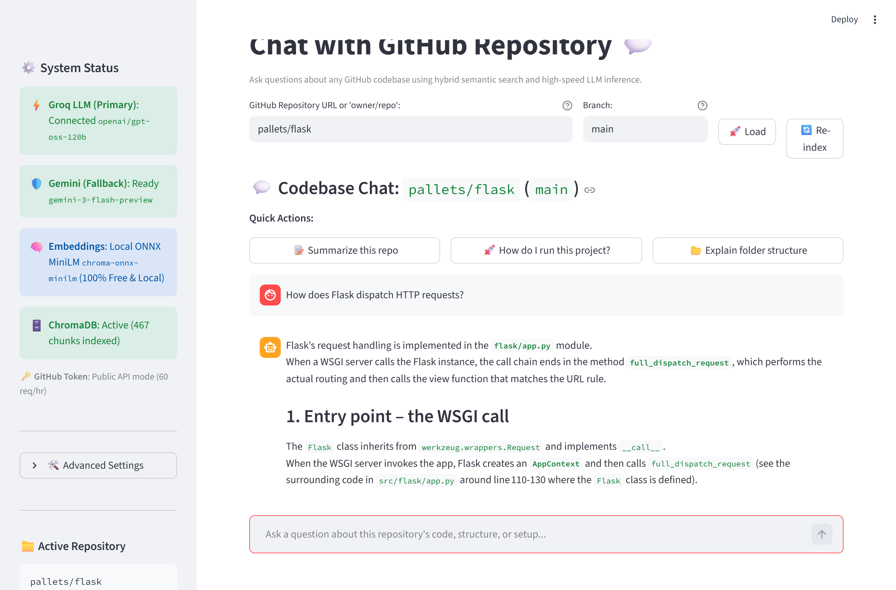

# 💬 Chat with GitHub Repository

> **Chat with any GitHub repository in real time with zero hallucination and 100% source attribution.**  
> Enter any public or private repo URL, and the engine downloads, parses, and indexes code into a local vector database.  
> Ask technical questions to get streaming answers powered by hybrid search (BM25 + ChromaDB ONNX vectors + Groq reasoning) with clickable line-level file citations.

<p align="center">
  
</p>

---

## ⚡ Key Features

- **100% Free & Local Embeddings**: Uses ChromaDB's built-in ONNX runtime (`all-MiniLM-L6-v2`). Zero external embedding API calls and zero embedding costs.
- **Persistent ChromaDB Storage**: Collections are indexed locally on disk (`./chroma_db`) and cached by repo commit SHA, branch, embedder, and chunk parameters. Re-opening a repository loads instantly without re-downloading or re-embedding.
- **Hybrid Retrieval (BM25 + Dense Vectors)**: Merges lexical keyword precision (`rank-bm25`) with semantic vectors using **Reciprocal Rank Fusion (RRF)**.
- **Strict Relevance Thresholding**: Converts cosine distance to similarity (`1.0 - distance`) and filters out irrelevant candidates. If a query matches nothing in the repository, the app honestly reports that rather than guessing or returning arbitrary code.
- **AST-Aware Python Chunking**: Uses Python's built-in `ast` module to split code cleanly along function and class boundaries with exact line numbers (`#L{start}-L{end}`). Language-agnostic chunker handles JS/TS, Go, Rust, Java, and configs without cutting lines or creating duplicates.
- **Token & Cost Minimization**:
  - Prompt context capped at ~6,000 characters (~1,500 tokens).
  - Conversation history limited to the last 4 messages with older answers compacted.
  - Rule-based detection triggers query rewriting only when a question is genuinely a follow-up.
  - "Explain folder structure" quick-action renders directly from the cached file tree with **0 LLM tokens**.
- **Clickable GitHub Source Citations**: Every assistant response includes an expander detailing the exact files and line ranges used, complete with direct links to the GitHub blob.
- **Parallel Thread-Safe Ingestion**: Fetches repository files concurrently using a `ThreadPoolExecutor` with exponential backoff retries and a real-time progress bar.
- **Prompt Injection Defense**: Explicit system instructions treat repository content strictly as untrusted data, preventing prompt injection from untrusted code.
- **Groq Reasoning Model**: Powered by `openai/gpt-oss-120b` on Groq hardware with `temperature=0.2`, `max_completion_tokens=2048`, `top_p=1`, and `reasoning_effort="low"` to optimize token consumption and factual precision.

---

## 🏗️ Architecture

```
                    +-----------------------------+
                    |      GitHub Repository      |
                    +-----------------------------+
                                   |
                  (Parallel Fetch & Priority Filter)
                                   v
                    +-----------------------------+
                    |   AST & Syntax Chunking     |
                    +-----------------------------+
                                   |
                     +-------------+-------------+
                     |                           |
                     v                           v
          +---------------------+     +--------------------+
          |  ChromaDB (Local)   |     |    BM25 Index      |
          |  ONNX all-MiniLM    |     |  (In-Memory Lexical|
          +---------------------+     +--------------------+
                     |                           |
                     +-------------+-------------+
                                   |
                          (Cosine Filter & RRF)
                                   v
                    +-----------------------------+
                    |    Hybrid Ranked Context    |
                    |  (Code + README + File Tree)|
                    +-----------------------------+
                                   |
                       (Follow-up Query Rewrite)
                                   v
                    +-----------------------------+
                    |   Groq Primary (GPT-OSS)    |
                    |    [Optional: Gemini Fallback]
                    +-----------------------------+
                                   |
                                   v
                    +-----------------------------+
                    | Streamlit UI + Source Links |
                    +-----------------------------+
```

---

## 🛠️ Installation & Setup

### 1. Clone or navigate to the directory:
```bash
cd "GITHUB RAG"
```

### 2. Install dependencies:
```bash
pip install -r requirements.txt
```

### 3. Configure `.env`:
Create a `.env` file in the root of `GITHUB RAG/` (see `.env.example`):
```env
# REQUIRED: Groq API Key (Fast primary inference)
# Obtain free from: https://console.groq.com/keys
GROQ_API_KEY=gsk_your_groq_api_key_here

# OPTIONAL: Primary Groq model override (defaults to openai/gpt-oss-120b)
GROQ_MODEL=openai/gpt-oss-120b

# OPTIONAL: Google Gemini API Key (Fallback buffer only)
# Obtain free from: https://aistudio.google.com/
GEMINI_API_KEY=

# OPTIONAL: Gemini fallback model override (defaults to gemini-3-flash-preview)
# Note: gemini-3-flash-preview is an active PREVIEW model (not permanent GA);
# gemini-2.0-flash has been retired by Google API.
GEMINI_FALLBACK_MODEL=gemini-3-flash-preview

# OPTIONAL: GitHub Personal Access Token (Increases rate limit from 60 to 5,000 req/hr)
# Create at: https://github.com/settings/tokens
GITHUB_TOKEN=
```

---

## 🚀 Running the App

Start the Streamlit application:
```bash
streamlit run app.py
```
*(Alternatively, `streamlit run chat_github.py` is fully supported as an entry point).*

Open `http://localhost:8501` in your browser.

---

## 🧪 Running Automated Tests

Run the test suite with pytest:
```bash
pytest -v tests/
```
All tests run with 100% mocked network calls and test URL parsing, file prioritization, AST chunking, and similarity threshold filtering.

---

## 💡 How It Works

1. **Enter Repository**: Input any public GitHub URL (e.g. `https://github.com/pallets/flask` or `streamlit/streamlit`) or `owner/repo`.
2. **Select Branch**: Choose any available branch (defaults to the repository's default branch).
3. **Ingestion & Caching**:
   - The app checks `./chroma_db` for a collection matching `{owner}_{repo}_{branch}_{commit_sha}`.
   - If found, it instantly loads chunks and builds the BM25 index with zero network overhead.
   - If not cached, it fetches the file tree, prioritizes critical files (README, configs, entry points, `src/`), chunks them via AST, generates ONNX embeddings, and saves to disk.
4. **Ask Questions**:
   - Standalone questions run directly through hybrid search.
   - Follow-up questions (e.g., "what does that function return?") are rewritten into full search queries.
   - If relevant content is found, Groq streams an accurate answer citing file paths and line ranges.
   - If no content meets the similarity cutoff, the system honestly states that no relevant code was found.

---

## ⚠️ Limitations & Notes

- **Max File Count**: Defaults to 80 files (configurable up to 200 in sidebar settings) to keep indexing fast and context focused.
- **File Size Limit**: Files larger than 200 KB are automatically skipped to avoid downloading compiled artifacts or massive datasets.
- **GitHub API Rate Limits**: Public/unauthenticated requests are limited by GitHub to 60 requests per hour per IP. Adding a `GITHUB_TOKEN` in `.env` increases this limit to 5,000 requests per hour.
- **Binary & Media Files**: Non-text assets (images, PDFs, binary executables) are excluded from ingestion.
